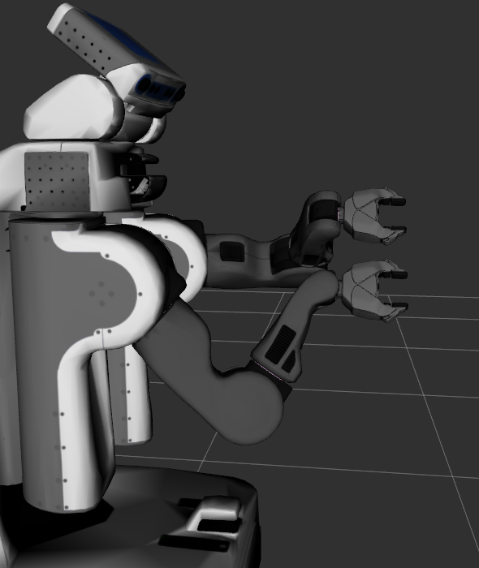

# Bio_IK2

## Table of Contents

- [How it works](#how-it-works)
- [Disclaimer](#disclaimer)
- [Installation and Setup](#installation-and-setup)
- [Basic Usage](#basic-usage)
- [Advanced Usage](#advanced-usage)
  - [Using IKCostFn](#using-ikcostfn)
  - [Using BioIKKinematicsQueryOptions](#using-bioikkinematicsqueryoptions)
- [Local vs. Global Optimization, Redundancy Resolution, Cartesian Jogging](#local-vs-global-optimization-redundancy-resolution-cartesian-jogging)
  - [Disabling Global Optimization](#disabling-global-optimization)
  - [Regularization](#regularization)
- [References](#references)
- [Links](#links)


## How it works

The bio_ik solver is based on a memetic algorithm that combines
gradient-based optimization with genetic and particle swarm optimization.

Internally, vectors of all robot joint values are used to encode
different intermediate solutions (the *genotype* of the genetic algorithm).
During the optimization, joint values are always checked against the
active lower and upper joint limits, so that only valid robot configurations
are generated.

To calculate the fitness of individuals, the cumulative error over all
given individual goals is calculated.
Any individual with zero error is an exact solution for the IK problem,
while individuals with small error correspond to approximate solutions.

Individuals are sorted by their fitness, and gradient-based optimization
is tried on the best few configuration, resulting in fast convergence
and good performance for many problems.
If no solution is found from the gradient-based optimization,
new individuals are created by a set of mutation and recombination operators,
resulting in good search-space exploration.

See [3] and [4] for more details. See [5] and [6] for an in-depth explanation of an 
earlier evolutionary algorithm for animating video game characters.


## Disclaimer

This repository provides a BSD-licensed standalone implementation
of a variety of optimization methods to efficiently solve generalized inverse kinematics problems.

The whole module was implemented by Philipp Ruppel as part of his Master Thesis.

For a C++-based reimplementation of the original "BioIK" algorithm,
as originally sold in the Unity store, you can use the non-default mode `bio1`.
The default mode `bio2_memetic` shares no code with this implementation, was shown to outperform it
in terms of success rate, precision and efficiency, and is actually usable for precise robotic applications [4].

## Installation and Setup

You will need ROS 2: [https://docs.ros.org/en/rolling/Installation.html](https://docs.ros.org/en/rolling/Installation.html).

This version of the software was developed on Ubuntu Linux 22.04 LTS with ROS 2 Humble.
Newer versions of ROS 2 should work, but may need some adaptation.
See below for version specific instructions.

1. Clone the repository in your workspace:

```bash
cd <PATH TO WORKSPACE>/src
git clone https://github.com/LeoBoticsHub/bio_ik2_ros2.git -b ros2
```

2. Build the workspace:
```bash
cd <PATH TO WORKSPACE>
colcon build --merge-install --cmake-args "-DCMAKE_BUILD_TYPE=Release"
```

3. Configure Moveit to use bio_ik2 as the kinematics solver (see next section).
4. Use Moveit to plan and execute motions or use your own code together with `move_group` node to move your robot.


As usual, the public API is specified in the public header files for the `bio_ik` package,
located in the `include/bio_ik` subdirectory;
the sources including a few private header files are in the `src` subdirectory.


## Basic Usage 

For ease of use and compatibility with existing code,
the bio_ik2 algorithm is encapsulated as a Moveit kinematics plugin.
Therefore, bio_ik2 can be used as a direct replacement of
the default Orocos/KDL-based IK solver.
Given the name of an end-effector and a 6-DOF target pose,
bio_ik will search a valid robot joint configuration that reaches the given target.

In our tests (see below), both in terms of success rate and solution time,
bio_ik2 regularly outperformed the Orocos [1] solver
and is competitive with trac-ik [2].
The bio_ik2 algorithm can also be used for high-DOF system like robot snakes,
and it will automatically converge to the best approximate solutions
for low-DOF arms where some target poses are not reachable exactly.

Once configured, the solver can be called using the standard Moveit API
or used interactively from rviz using the MotionPlanning GUI plugin.

1. Make sure that you have a URDF (or xacro) model for your robot and a SRDF file that defines the kinematic chain for the robot arm.

2. Edit the `config/kinematics.yaml` configuration file of your `moveit_config` package.
  For example, a configuration for the Franka Emika Panda robot might look like this:

```yaml
panda_arm:
    kinematics_solver: bio_ik/BioIKKinematicsPlugin
    kinematics_solver_search_resolution: 0.005
    kinematics_solver_timeout: 0.005
    kinematics_solver_attempts: 1
    mode: bio2_memetic # [DEFAULT: bio2_memetic]
          # Local optimizer:  naming convention <solver type>_[<variant>_]<number of threads>
          # gd, gd_2, gd_4, gd_8
          # gd_r, gd_r_2, gd_r_4, gd_r_8
          # gd_c, gd_c_2, gd_c_4, gd_c_8
          # jac, jac_2, jac_4, jac_8
          # Global optimizers: bio1, bio2_memetic
        
```


After enabling the Motion Planning Plugin in Rviz, it is recommended to check the "Approx IK Solutions" box before attempting to move the arm.
This will result in the IK solver returning approximate solutions if no exact solution is found within the specified timeout.


You are now ready to use bio_ik2 from your C/C++ and Python programs, using the standard Moveit API.
To explicitly request an IK solution in C++:

```c++
  robot_model_loader::RobotModelLoader robot_model_loader(robot);

  auto robot_model = robot_model_loader.getModel();
  auto joint_model_group = robot_model->getJointModelGroup(group);
  auto tip_names = joint_model_group->getSolverInstance()->getTipFrames();

  kinematics::KinematicsQueryOptions opts;
  opts.return_approximate_solution = true; // optional

  robot_state::RobotState robot_state_ik(robot_model);

  const geometry_msgs::msg::Pose pose;

  // Several overloads for setFromIK are available
  // here, we plass the joint model group, desired pose, and a timeout.
  // We can leave the callback and options empty.
  // Several desired poses can be passed with a separate overload
  bool ok = robot_state_ik.setFromIK(
              joint_model_group, // joints to be used for IK
              pose,    // end-effector goal pose
              timeout, // solver attempts and timeout
              moveit::core::GroupStateValidityCallbackFn(),
              opts               // mostly empty
            );
```

## Advanced Usage

For many robot applications, it is essential to specify more than just
a single end-effector pose. Typical examples include

* redundancy resolution (e.g. 7-DOF arm)
* two-arm manipulation tasks on two-arm robots (e.g. Baxter)
* multi end-effector tasks with shared kinematic links
* grasping and manipulation tasks with multi-finger hands
* full-body motion on humanoid robots
* reaching tasks with additional constraints (e.g. shoulder position)
* incremental tool motions without robot arm configuration changes
* and many more

In bio_ik2, such tasks are specified as a combination of multiple individual *goals*.  
The algorithm then tries to find a robot configuration
that fulfills all given goals simultaneously by minimizing
a quadratic error function built from the weighted individual goals.

There 2 primary ways of specifying different cost functions in bio_ik2:
- Using an `IKCostFn` instance, a function that can be directly integrated in the `robot_state::setFromIK` function call, inside MoveIt APIs.
- Using the `BioIKKinematicsQueryOptions` struct, which allows to specify multiple goals and their weights. This struct can be passed to the `robot_state::setFromIK` function call,
  but works only with the `bio_ik/BioIKKinematicsPlugin` solver, so it is not portable to other solvers.
  It can also be passed to the `kinematics_base::searchPositionIK` function call, inside MoveIt APIs.

Definining custom goal cost functions is a powerful tool, but it is also a double-edged sword.
The custom cost functions are called for every iteration of the optimization algorithm.
It is important to keep the cost function as lightweight as possible.
Heavy computations should be avoided, as they will slow down the optimization process.

### Using IKCostFn

While the current Moveit API does not support specifying the various derivations of bio_ik's `Goal` type directly (doing so would require creating a circular dependency),
one may specify an instance of [`kinematics::KinematicsBase::IKCostFn`](https://github.com/ros-planning/moveit2/blob/1d67b519e6ef9ca1ebba494743791da998b72950/moveit_core/kinematics_base/include/moveit/kinematics_base/kinematics_base.h#L158) when querying for IK solutions. 
In bio_ik, this cost function gets converted to a `IKCostFnGoal` type when the proper overload of `searchPositionIK` is called. 
This is supported by MoveIt's `KinematicsBase::searchPositionIK` directly, `RobotState::setFromIK`, `CartesianInterpolator::computeCartesianPath`, and even MoveIt Task Constructor's `CartesianPath` solver. 
It is the responsibility of the `IKCostFn` to provide its own weighting. 
The cost function should return lower values when closer to the desired goal. 
One may use a single `IKCostFn` to implement weighting of multiple custom goals. 
Note that such a cost function goal will not eliminate the goal created for a pose passed to each IK call. 
See below for an example of an `IKCostFn` instance that prioritizes the Yoshikawa manipulability of the robot. 
Note that such a goal will create a trade-off between position accuracy and manipulability that may be tuned via the weighting.

```c++
  // empty, so it will be ignored
  moveit::core::GroupStateValidityCallbackFn callback_fn;
  // Jacobian -> Yoshikawa manipulability
  const auto getManipulability = [](Eigen::MatrixXd jacobian) {
    return sqrt((jacobian * jacobian.transpose()).determinant());
  };
  // the manipulability is usually < 0.1, so weighting usually needs to be pretty low here.
  const double sing_weight = 0.00001;
  const kinematics::KinematicsBase::IKCostFn sing_avoid_cost = [&sing_weight, &getManipulability](const geometry_msgs::msg::Pose& /*goal_pose*/,
                                                                  const moveit::core::RobotState& solution_state,
                                                                  moveit::core::JointModelGroup* jmg,
                                                                  const std::vector<double>& seed_state) {
    auto jac = solution_state.getJacobian(jmg);
    // associate low manipulability with high cost
    return sing_weight / getManipulability(jac);
  };
  kinematics::KinematicsQueryOptions opts;
  opts.return_approximate_solution = true;
  // when using an instance of IKCostFn, you may need to increase the timeout from the default specified in kinematics.yaml
  // target_pose should be a real pose that we wish to achieve, and not empty as is shown in future examples.
  current_state->setFromIK(joint_model_group, target_pose, 0.05, callback_fn, opts, sing_avoid_cost);
```

**Warning**:

This method is not recommended because evaluating the cost function is costly and will slow down the optimization process.
Here the cost function is implemented as a lambda function, then converted into a `std::function` object.
The lambda function acts as a pointer to the function and is not an efficient way to implement the cost function.
See the method below for applying multiple goals to the IK solver in a more efficient way.

### Using BioIKKinematicsQueryOptions

Alternatively to the use of `IKCostFn`, one may specify multiple goals via the `BioIKKinematicsQueryOptions`, which inherits from 
MoveIt's `KinematicsQueryOptions`. Note that this is the recommended way to specify goals, as it is more efficient than using `IKCostFn`.
bio_ik2 provides a set of predefined motion goals, and a combination of the user-specified goals may be passed to the IK solver.
No API changes are required in Moveit, but using the IK solver now consists passing the weighted goals via the `KinematicQueryOptions`.
The predefined goals, specified inside `include/bio_ik/goal_types.h` include:

* *PoseGoal*: a full 6-DOF robot pose
* *PositionGoal*: a 3-DOF (x,y,z) position
* *OrientationGoal*: a 3-DOF orientation, encoded as a quaternion (qx,qy,qz,qw)
* *LookAtGoal*: a 3-DOF (x,y,z) position intended as a looking direction
   for a camera or robot head
* *JointGoal*: a set of joint angles, e.g. to specify a
* *FunctionGoal*: an arbitrary function of the robot joint values,
   e.g. to model underactuated joints or mimic joints
* and several more

Note that there are primary and secondary goal functions:
- primary goals: the solver will optimize the solution to minimize the error of these goals. The computation is more expensive because of the optimization process.
  It is necessary to specify at least one primary goal. Specify the least number of primary goals as possible to reduce the computation time.
- secondary goals: the solver will try to minimize the error of these goals, but the computation is less expensive because the optimization process is not applied to these goals.
  It is possible to specify multiple secondary goals. They are useful to specify additional constraints to the solution. Secondary goals are optional and can be specified
  by setting the flag `secondary_ = true` in the goal object.


To solve a motion problem on your robot, the trick now is to construct
a suitable combination of individual goals.



In the following example, we want to grasp and then _slowly turn
a valve wheel_ with the left and right gripers of the PR2 robot:

```c++
  bio_ik::BioIKKinematicsQueryOptions ik_options;
  ik_options.replace = true;
  ik_options.return_approximate_solution = true;

  auto* ll_goal = new bio_ik::PoseGoal();
  auto* lr_goal = new bio_ik::PoseGoal();
  auto* rl_goal = new bio_ik::PoseGoal();
  auto* rr_goal = new bio_ik::PoseGoal();
  ll_goal->setLinkName("l_gripper_l_finger_tip_link");
  lr_goal->setLinkName("l_gripper_r_finger_tip_link");
  rl_goal->setLinkName("r_gripper_l_finger_tip_link");
  rr_goal->setLinkName("r_gripper_r_finger_tip_link");
  ik_options.goals.emplace_back(ll_goal);
  ik_options.goals.emplace_back(lr_goal);
  ik_options.goals.emplace_back(rl_goal);
  ik_options.goals.emplace_back(rr_goal);
```

We also set a couple of secondary goals.
First, we want that the head of the PR2 looks at the center of the valve.
Second, we want to avoid joint-limits on all joints, if possible.
Third, we want that IK solutions are as close as possible to the previous
joint configuration, meaning small and efficient motions. This is handled
by adding the MinimalDisplacementGoal.
Fourth, we want to avoid torso lift motions, which are very slow on the PR2.
All of this is specified easily:

```c++
  auto* lookat_goal = new bio_ik::LookAtGoal();
  lookat_goal->setLinkName("sensor_mount_link");
  ik_options.goals.emplace_back(lookat_goal);

  auto* avoid_joint_limits_goal = new bio_ik::AvoidJointLimitsGoal();
  ik_options.goals.emplace_back(avoid_joint_limits_goal);

  auto* minimal_displacement_goal = new bio_ik::MinimalDisplacementGoal();
  ik_options.goals.emplace_back(minimal_displacement_goal);

  auto* torso_goal = new bio_ik::PositionGoal();
  torso_goal->setLinkName("torso_lift_link");
  torso_goal->setWeight(1);
  torso_goal->setPosition(tf2::Vector3( -0.05, 0, 1.0 ));
  ik_options.goals.emplace_back(torso_goal);
```

For the actual turning motion, we calculate a set of required gripper
poses in a loop:
```c++
  for(int i = 0; ; i++) {
      tf2::Vector3 center(0.7, 0, 1);

      double t = i * 0.1;
      double r = 0.1;
      double a = sin(t) * 1;
      double dx = fmin(0.0, cos(t) * -0.1);
      double dy = cos(a) * r;
      double dz = sin(a) * r;

      tf2::Vector3 dl(dx, +dy, +dz);
      tf2::Vector3 dr(dx, -dy, -dz);
      tf2::Vector3 dg = tf2::Vector3(0, cos(a), sin(a)) * (0.025 + fmin(0.025, fmax(0.0, cos(t) * 0.1)));

      ll_goal->setPosition(center + dl + dg);
      lr_goal->setPosition(center + dl - dg);
      rl_goal->setPosition(center + dr + dg);
      rr_goal->setPosition(center + dr - dg);

      double ro = 0;
      ll_goal->setOrientation(tf2::Quaternion(tf2::Vector3(1, 0, 0), a + ro));
      lr_goal->setOrientation(tf2::Quaternion(tf2::Vector3(1, 0, 0), a + ro));
      rl_goal->setOrientation(tf2::Quaternion(tf2::Vector3(1, 0, 0), a + ro));
      rr_goal->setOrientation(tf2::Quaternion(tf2::Vector3(1, 0, 0), a + ro));

      lookat_goal->setAxis(tf2::Vector3(1, 0, 0));
      lookat_goal->setTarget(rr_goal->getPosition());

      // "advanced" bio_ik usage. The call parameters for the end-effector
      // poses and end-effector link names are left empty; instead the
      // requested goals and weights are passed via the ik_options object.
      //
      robot_state.setFromIK(
                    joint_model_group,             // active PR2 joints
                    EigenSTL::vector_Isometry3d(), // no explicit poses here
                    std::vector<std::string>(),    // no end effector links here
                    0.0,                           // take value from YAML file
                    moveit::core::GroupStateValidityCallbackFn(),
                    ik_options                     // four gripper goals and secondary goals
                  );

      ... // check solution validity and actually move the robot
  }
```

When you execute the code, the PR2 will reach for the valve wheel
and turn it. Every once in a while it can't reach the valve with
its current arm configuration and will regrasp the wheel.

See [3] and [4] for more examples. 


## Local vs. Global Optimization, Redundancy Resolution, Cartesian Jogging

BioIK2 has been developed to efficiently find good solutions for non-convex inverse kinematics problems with multiple goals and local minima.
However, for some applications, this can lead to unintuitive results.
If there are multiple possible solutions to a given IK problem, and if the user has not explicitly specified which one to choose, a result may be selected randomly from the set of all valid solutions.
When incrementally tracking a cartesian path, this can result in unwanted jumps, shaking, etc.
To incrementally generate a smooth trajectory using BioIK, the desired behaviour should be specified explicitly, which can be done in two ways.

#### Disabling Global Optimization

BioIK offers a number of different solvers, including global optimizers and local optimizers.
By default, BioIK uses a memetic global optimizer (`bio2_memetic`).
A different solver class can be selected by setting the `mode` parameter in the `kinematics.yaml` file of your MoveIt robot configuration.

Example:
```yaml
all:
  kinematics_solver: bio_ik/BioIKKinematicsPlugin
  kinematics_solver_search_resolution: 0.005
  kinematics_solver_timeout: 0.02
  kinematics_solver_attempts: 1.0
  mode: gd_c
```

Currently available local optimizers:
```
gd, gd_2, gd_4, gd_8
gd_r, gd_r_2, gd_r_4, gd_r_8
gd_c, gd_c_2, gd_c_4, gd_c_8
jac, jac_2, jac_4, jac_8
```

Naming convention: `<solver type>_[<variant>_]<number of threads>`

Notes:
- The `gd_*` solvers support arbitrary goal types.
- During our tests, the `gd_c` variants usually outperformed the other local solvers.
- The `jac_*` solvers only support pose goals but might in theory be more stable in some cases.
- Relative performance depends on the application (it's probably best if you try it yourself for your particular robot and problem types).
- For incremental tracking, a single-threaded variant without restarts is probably best suited (`gd_c`, `gd`, or `jac`).
- The `gd_c_<n>` solvers are multi-threaded but at the current state of the repository, they do not offer any performance benefits. They are often less stable than the single-threaded variants.
- You can also create different MoveIt move groups with different solver types. If you now want to plan a cartesian trajectory from end effector pose A to end effector pose B, you can use a move group with a global optimizer to find a matching initial pose for end effector pose A and a different move group with a local optimizer for incrementally generating a smooth cartesian trajectory from A to B.

#### Regularization

You can force a global optimizer to return a local minimum through regularization. 

* For the specific case of incremental robot motions (aka *jogging*),
  the simplest solution is to specify both a *PoseGoal* and the
  special *RegularizationGoal*, which tries to keep the joint-space
  IK solution as close as possible to the given robot seed configuration.
  Typically you would use a high weight for the *PoseGoal* and a
  smaller weight to the regularizer.

* You can also add a *MinimalDisplacementGoal* instead of the
  *RegularizationGoal*. Both goals try to keep the IK solution close
  to the current/seed robot state, but differ slightly in the handling
  of fast and slow robot joints (e.g. the PR2 has fast arm joints
  and a rather slow torso lift joint).
  You might want to play with both goals to see which one better
  matches your needs.

* Some industrial robot controllers on 7-DOF arms behave as if working
  on a 6-DOF arm with one extra joint. Typically, the value of the extra
  joint can be specified, and an IK solution is then searched for the
  remaining six joints.
  This behaviour can be achieved in bio_ik by combining a *PoseGoal*
  for the end-effector with a *JointPositionGoal* for one (any one)
  of the robot joints.

* Another useful trick is trying to keep the robot joints centered,
  as this will allow robot (joint) motions in both directions.
  Just combine the *PoseGoal* with a *CenterJointsGoal*, and optionally
  also a *RegularizationGaol*.


## References

 1. Orocos Kinematics and Dynamics, http://www.orocos.org

 2. P. Beeson and B. Ames, *TRAC-IK:
    An open-source library for improved solving of generic inverse kinematics*,
    Proceedings of the IEEE RAS Humanoids Conference, Seoul, Korea, November 2015.

 3. Philipp Ruppel, Norman Hendrich, Sebastian Starke, Jianwei Zhang, *Cost Functions to Specify Full-Body Motion and Multi-Goal Manipulation Tasks*, IEEE International Conference on Robotics and Automation, (ICRA-2018), Brisbane, Australia. DOI: [10.1109/ICRA.2018.8460799](http://doi.org/10.1109/ICRA.2018.8460799)

 4. Philipp Ruppel, *Performance optimization and implementation
    of evolutionary inverse kinematics in ROS*,
    MSc thesis, University of Hamburg, 2017
    [PDF](https://tams.informatik.uni-hamburg.de/publications/2017/MSc_Philipp_Ruppel.pdf)

 5. Sebastian Starke, Norman Hendrich, Jianwei Zhang,  *A Memetic
    Evolutionary Algorithm for Real-Time Articulated Kinematic Motion*,
    IEEE Intl. Congress on Evolutionary Computation (CEC-2017), p.2437-2479, June 4-8, 2017,
    San Sebastian, Spain.
    DOI: [10.1109/CEC.2017.7969605](http://doi.org/10.1109/CEC.2017.7969605)

 6. Sebastian Starke, Norman Hendrich, Dennis Krupke, Jianwei Zhang, *Multi-Objective
    Evolutionary Optimisation for Inverse Kinematics
    on Highly Articulated and Humanoid Robots*,
    IEEE Intl. Conference on Intelligent Robots and Systems (IROS-2017),
    September 24-28, 2017, Vancouver, Canada
   
## Links

- http://doi.org/10.1109/ICRA.2018.8460799
- https://github.com/TAMS-Group/bio_ik
- https://tams-group.github.io/bio_ik/
